# **Analyzing eCommerce Business Performance with SQL**
### Author : Althaaf Athaayaa Daffa Qushayyizidane

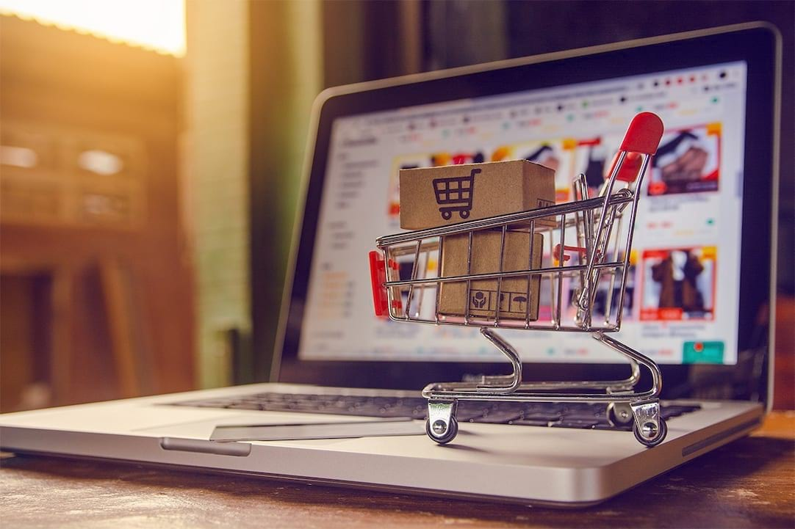

## **Background**

> Context: 

#### The company is one of the largest marketplaces in South America that connects micro-businesses with their customers. As a member of the Data Analytics team, I was responsible for analyzing three aspects related to the company's business performance. These include customer growth, product quality and payment types. I will process the data provided to create business performance reports on these three aspects.
 
 

## **Steps**

- Data Preparation
- Annual Customer Activity Growth Analysis
- Annual Product Category Quality Analysis
- Annual Payment Type Usage Analysis
 
 
 

# **Getting Started**

## Data Preparation

### Create a new database and its tables for the prepared data

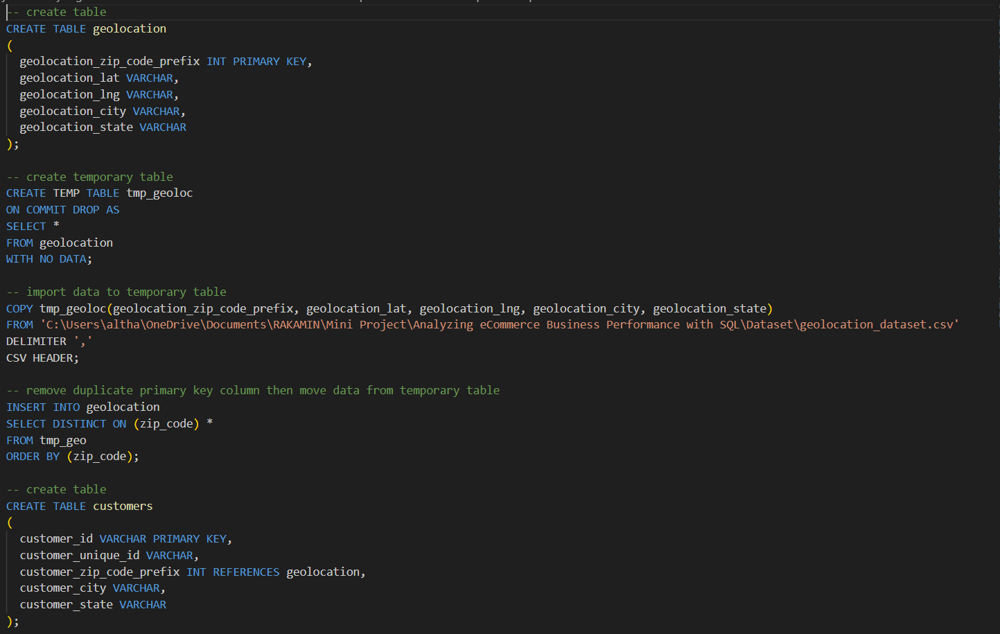

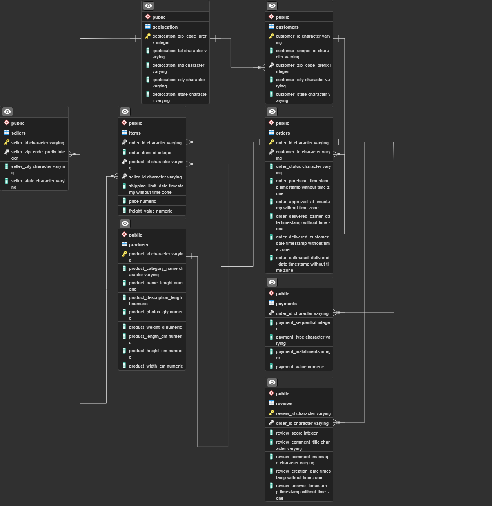

#### Create 8 tables -> `geolocation`, `customers`, `orders`, `reviews`, `payments`, `sellers`, `products`, `items`
 
 
 

## Annual Customer Activity Growth Analysis

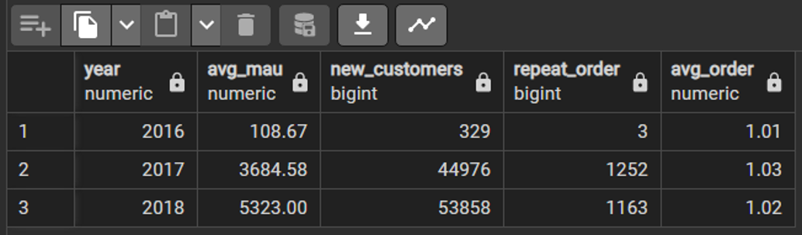
 

### *Monthly Active User (MAU)*
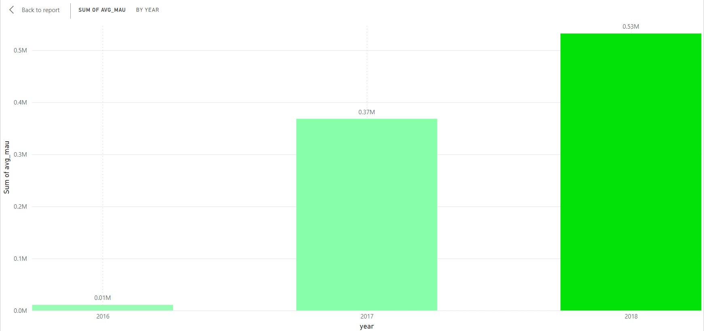

#### At 532300, 2018 had the highest MAU and was 4,798.32% higher than 2016, which had the lowest MAU at 10867.

#### 2018 had the highest MAU at 532300, followed by 2017 at 368458 and 2016 at 10867.

#### 2018 accounted for 58.39% of MAU.
 
 

### *New Customers*
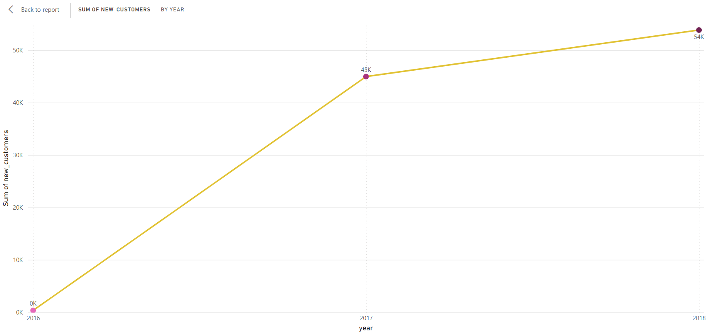

#### At 53858, 2018 had the highest Sum of new_customers and was 16,270.21% higher than 2016, which had the lowest Sum of new_customers at 329.

#### 2018 had the highest Sum of new_customers at 53858, followed by 2017 at 44976 and 2016 at 329.

#### 2018 accounted for 54.31% of Sum of new_customers.
 
 

### *Repeat Order*
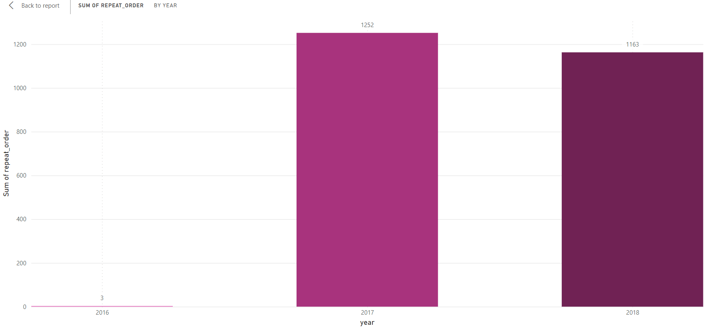

#### At 1252, 2017 had the highest Sum of repeat_order and was 41,633.33% higher than 2016, which had the lowest Sum of repeat_order at 3.

#### 2017 accounted for 51.78% of Sum of repeat_order.

#### 2016 had 3 Sum of repeat_order, 2017 had 1252, and 2018 had 1163.
 
 

### *Average Order*
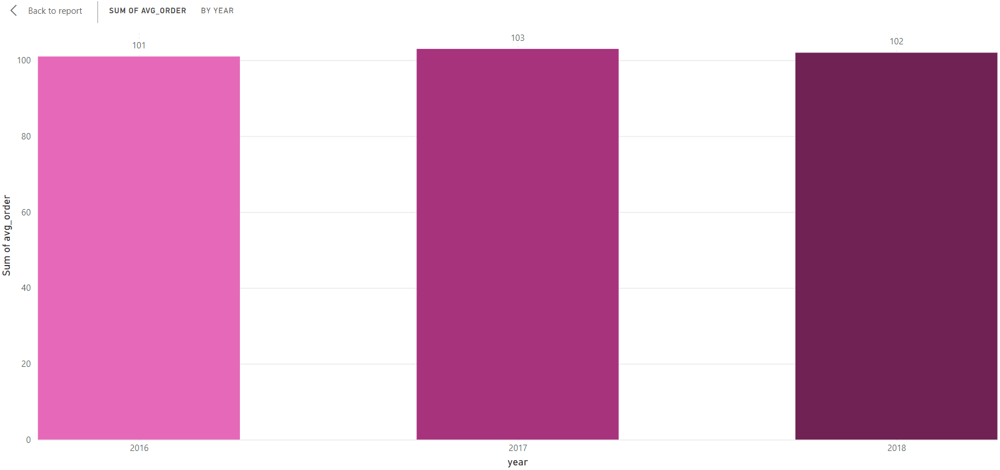

#### At 103, 2017 had the highest Sum of avg_order and was 1.98% higher than 2016, which had the lowest Sum of avg_order at 101.

#### 2017 accounted for 33.66% of Sum of avg_order.

#### 2016 had 101 Sum of avg_order, 2017 had 103, and 2018 had 102.
 
 
 

## Annual Product Category Quality Analysis

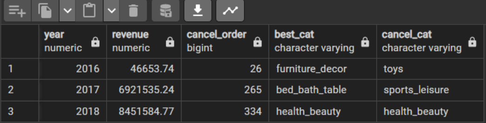
 

### *Revenue and Cancel Order*
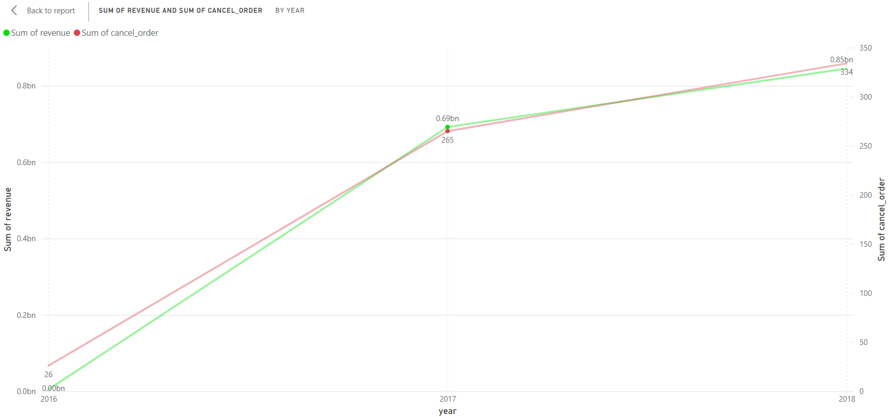

**Revenue** : In 2016 the Company's total revenue was only 46,653. Then in 2017 revenue increased drastically, amounting to 6,921,535 and in 2018 there was another increase of 8,451,584.

**Cancel Order** : In 2016 there were 26 canceled orders. Then in 2017 cancel orders increased quite high, namely 265 times and in 2018 there was still an increase in cancel orders, namely 334 times.
 
 

### *Best Cancel*
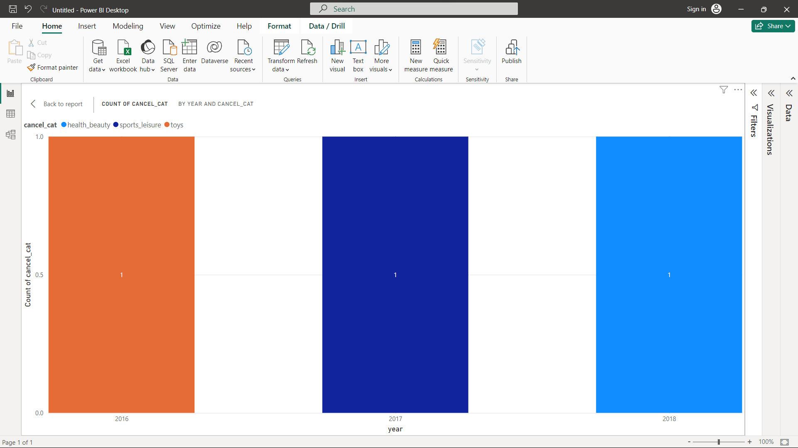

#### In 2016 the product that has the highest number of canceled orders is "toys". Then in 2017 the product that has the highest number of cancel orders is "sport leisure" and in 2018 the product that has the highest number of cancel orders is "health beauty".
 
 

### *Best Product*
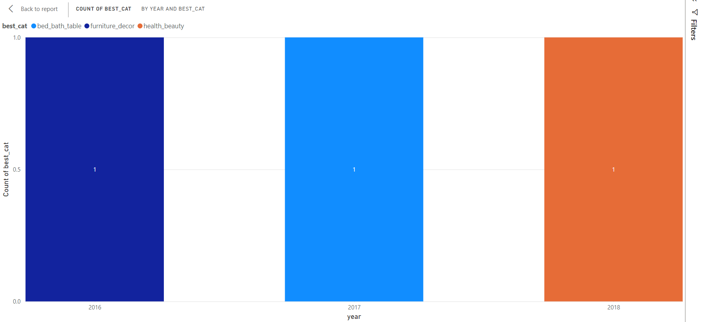

#### In 2016 the product that provided the highest total revenue was "furniture decor". Then in 2017 the product that provided the highest total revenue was "bed bath table" and in 2018 the product that provided the highest total revenue was "health beauty".
 
 
 

## Annual Payment Type Usage Analysis
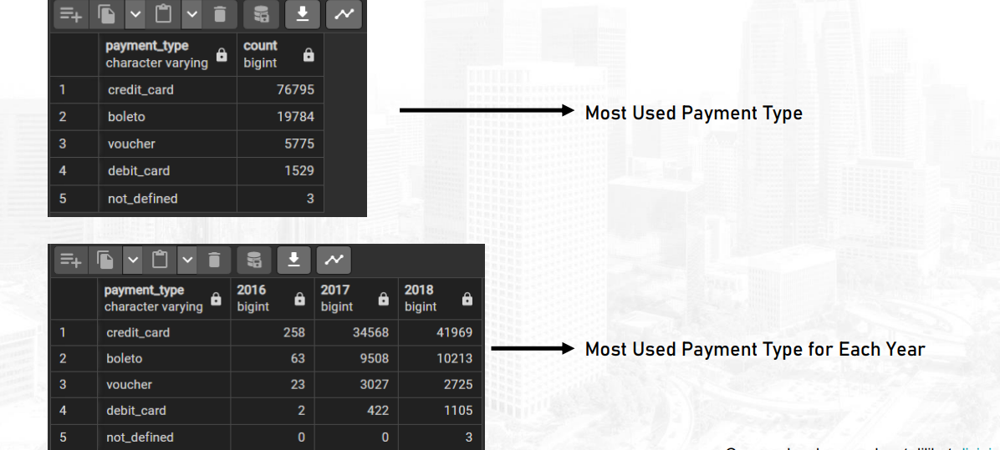
 

### *Most Used Payment Type*
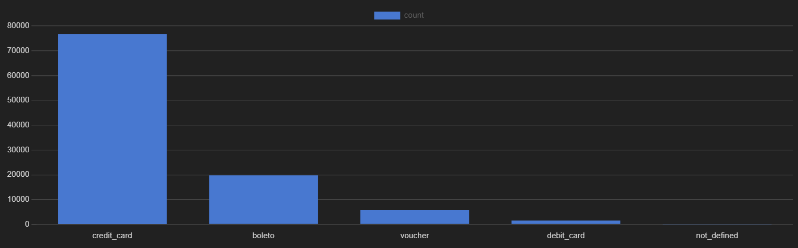

#### The most favorite type of payment is Credit Card with 76,795 uses, followed by boleto, voucher, and debit card.
 
 

### *Most Used Payment Type for Each Year*
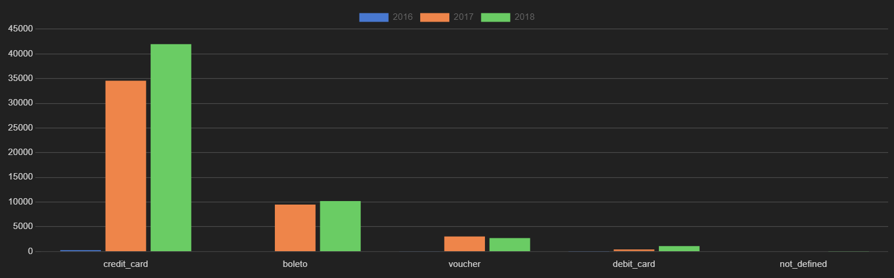

#### Credit card payment types have ranked the highest in the last 3 years with 258 in 2016, 34,568 in 2017, and 41,969 in 2018, followed by boleto, voucher, and debit cards.

